Адреса тестовых пользователей 

https://sepolia.etherscan.io/address/0xde92B3965459649B45500E41Ab39f330ca38D63b

https://sepolia.etherscan.io/address/0xB1f190f540e76B8bA87de716126a00Ca866E8d08

https://sepolia.etherscan.io/address/0x14BB8c242280b88369eEF21a44d422a2fb27d859

контракты:

https://sepolia.etherscan.io/address/0x358fb3823e145D8cDb09C620d5f65f0E1091Bbb4#code

https://sepolia.etherscan.io/address/0x9b5A3e425cF034e55C7336C2942857Ef6Bc732B1#code

https://sepolia.etherscan.io/address/0x8c2726BE09bD4f0188BCd1AaC28382FBcF988d14#code

ответы на вопросы 

Вопросы по стандартам ERC20, ERC721, ERC1155 (2 балл)

1. Что такое функция approve и как она используется?
Функция approve используется для предоставления разрешения 
указанному адресу (обычно смарт-контракту) управлять 
определенным количеством токенов, принадлежащих отправителю. 
Это разрешение устанавливает лимит токенов, 
которые могут быть переведены с использованием функции transferFrom, 
без дальнейшего участия владельца токенов.

2. В чем различие ERC721 и ERC1155?
ERC721 используется для создания уникальных невзаимозаменяемых токенов,
каждый из которых имеет свой уникальный идентификатор.
ERC1155 позволяет создавать как заменяемые токены (например, игровые монеты),
так и уникальные токены (например, NFT), объединяя их в одном контракте 
для снижения затрат на газ.

3. Что такое SBT токен?
SBT (Soulbound Token) — это непередаваемый токен, 
привязанный к определенной сущности или адресу.
Он используется для представления непередаваемых активов 
или достижений, таких как сертификаты или репутация.

4. Как можно сделать SBT токен?
Для создания SBT токена необходимо разработать смарт-контракт, 
где функции передачи и одобрения ограничены или отключены.
Это обычно делается на основе стандарта ERC721 
с модификацией функций transfer и approve, чтобы предотвратить передачу токена.

### фотоотчет 

Деплой
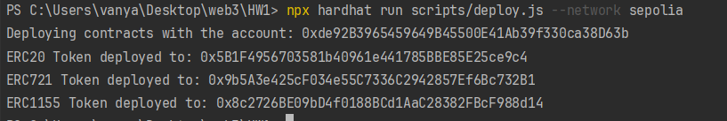

тесты
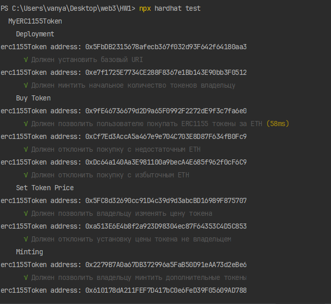

Верификация
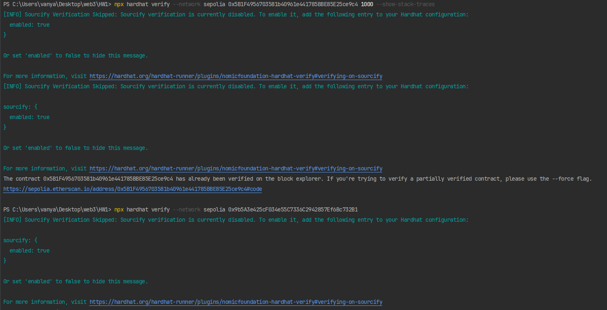

Интерактив
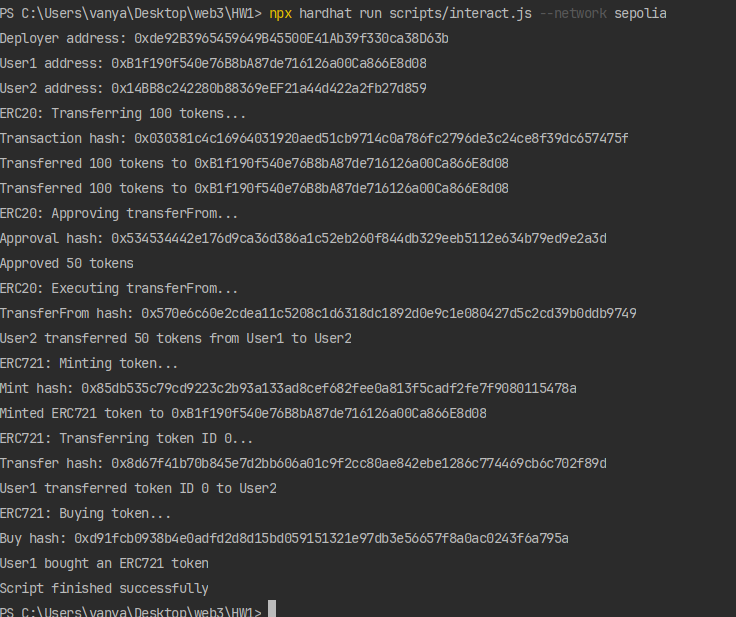

Баланс
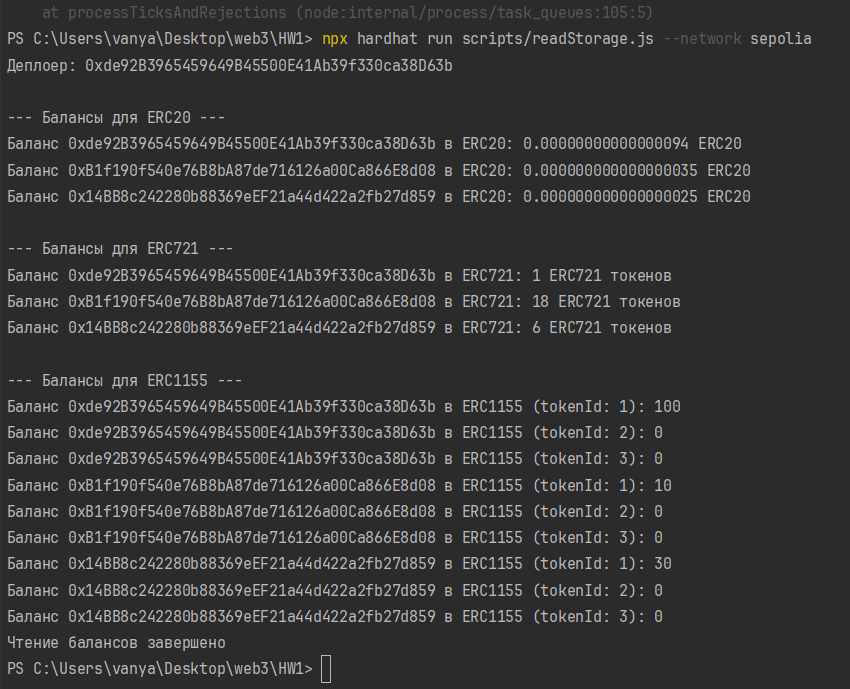

События
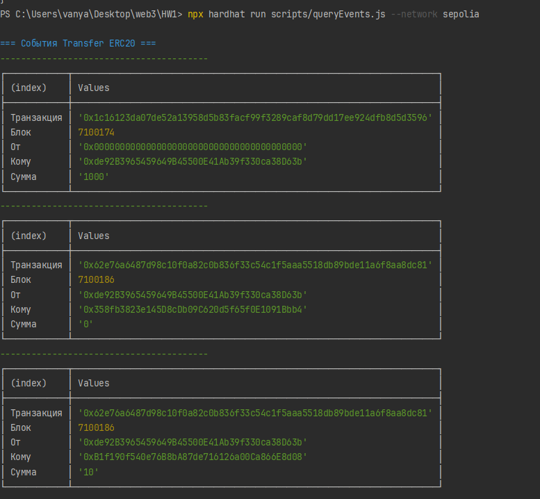

Транзакции
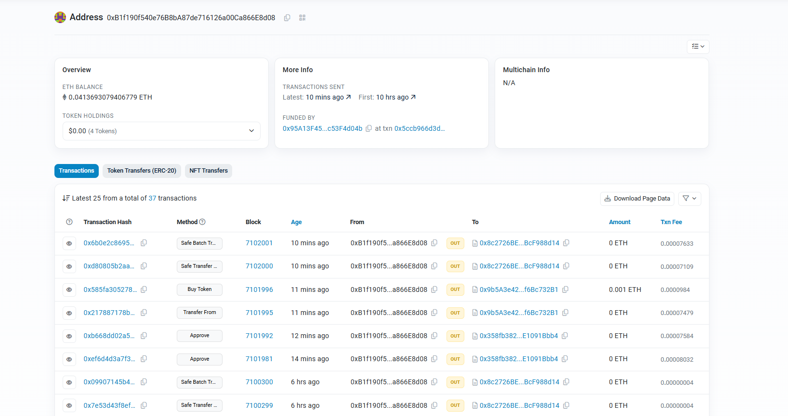

ERC-transfers примеры
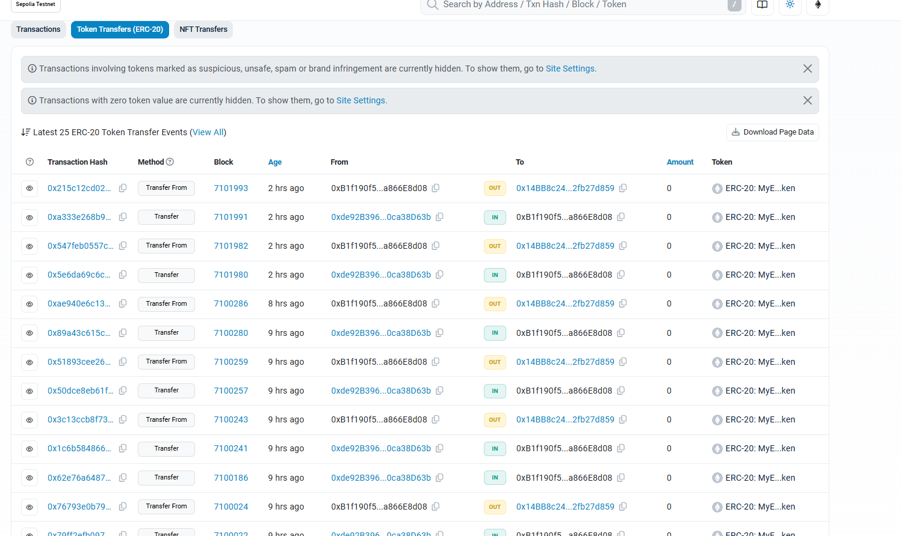

NFT-transfers примеры

Баланс в обозревателе 
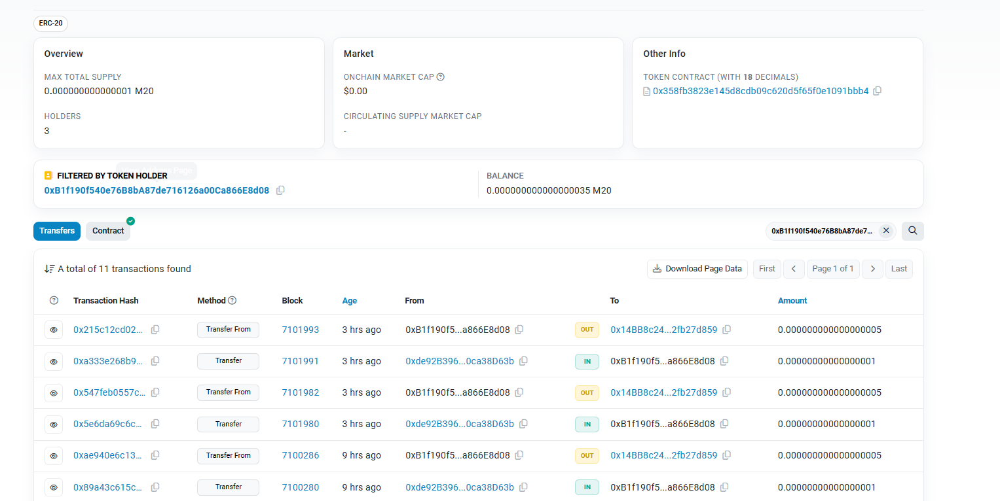

пример ERC-721
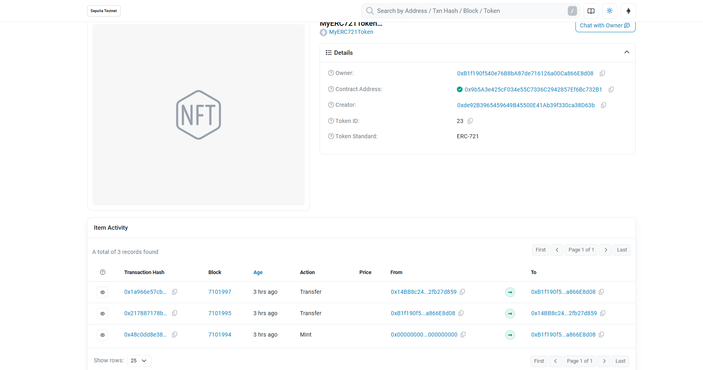

пример ERC-1155
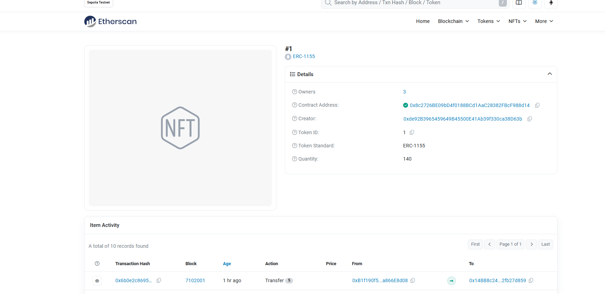

